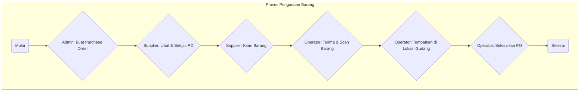
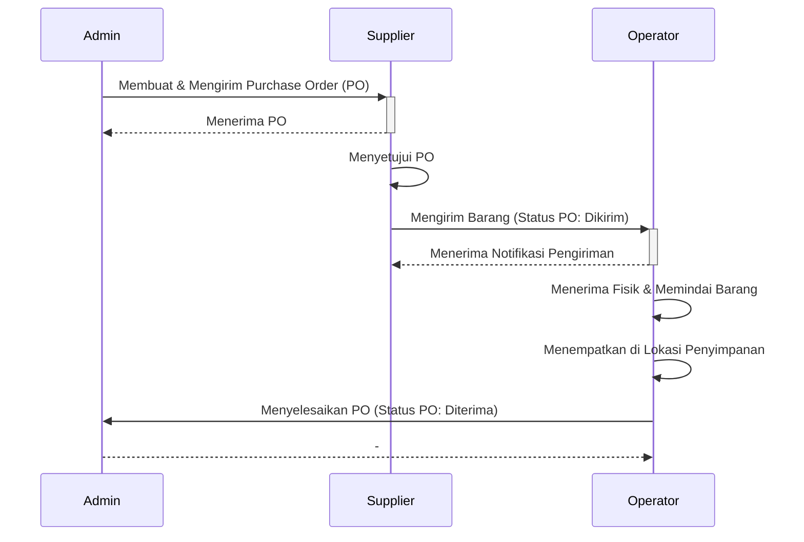
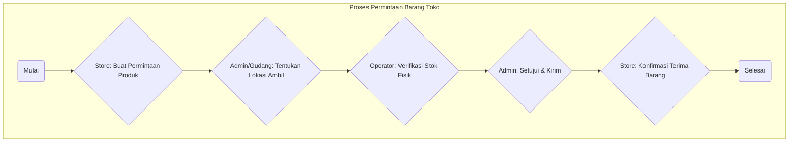
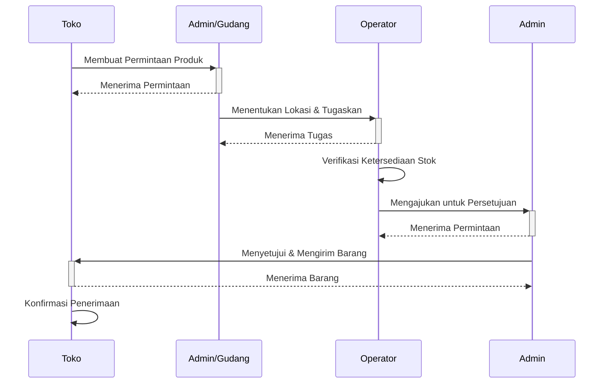

# Flowchart Proses Bisnis

Berikut adalah flowchart yang menggambarkan dua proses bisnis utama dalam aplikasi.

---

## 1. Flowchart Proses Pengadaan (Procurement)

### Diagram Peran (Swimlane)

---

## 2. Flowchart Proses Pengisian Ulang Toko (Store Replenishment)

### Diagram Peran (Swimlane)

